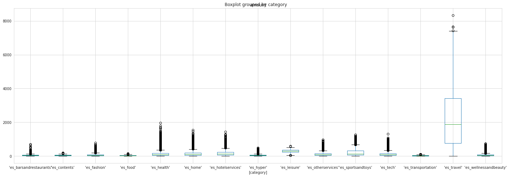
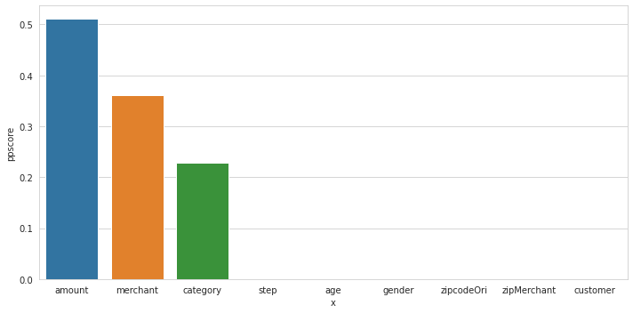
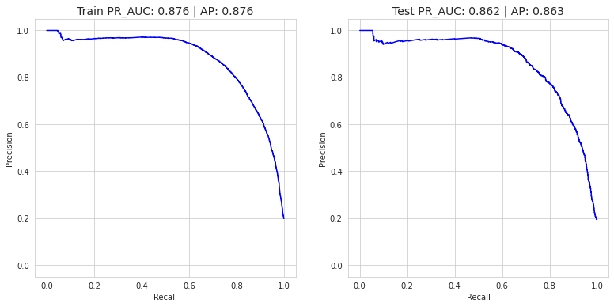
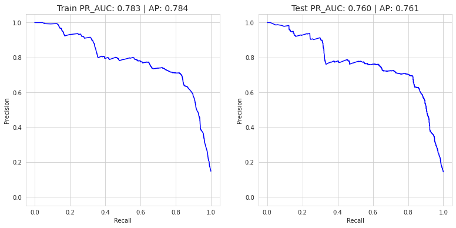
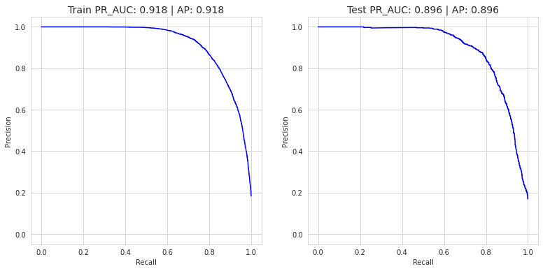

# Fraud Detection on Bank Payments

# Context

This Dataset taken from [Kaggle](https://www.kaggle.com/ntnu-testimon/banksim1)

# Original paper

Lopez-Rojas, Edgar Alonso ; Axelsson, Stefan
Banksim: A bank payments simulator for fraud detection research Inproceedings
26th European Modeling and Simulation Symposium, EMSS 2014, Bordeaux, France, pp. 144–152, Dime University of Genoa, 2014, ISBN: 9788897999324.
https://www.researchgate.net/publication/265736405_BankSim_A_Bank_Payment_Simulation_for_Fraud_Detection_Research

# Attributes Information

    Step: This feature represents the day from the start of simulation. 
    It has 180 steps so simulation ran for virtually 6 months.
    Customer: This feature represents the customer id
    Age: Categorized age
     0: <= 18,
     1: 19-25,
     2: 26-35,
     3: 36-45,
     4: 46-55,
     5: 56-65,
     6: > 65
     U: Unknown
    zipCodeOrigin: The zip code of origin/source.
    Merchant: The merchant's id
    zipMerchant: The merchant's zip code
    Gender: Gender for customer
        E : Enterprise,
        F: Female,
        M: Male,
        U: Unknown
    Category: Category of the purchase.
    Amount: Amount of the purchase
    Fraud: Target variable which shows if the transaction fraudulent(1) or benign(0)


```python
import pandas as pd
import numpy as np
import matplotlib.pyplot as plt
import seaborn as sns
import re

import ppscore as pps
from imblearn.pipeline import Pipeline
from imblearn.over_sampling import SMOTE
from imblearn.under_sampling import NearMiss
from sklearn.preprocessing import StandardScaler, OneHotEncoder
from sklearn.compose import ColumnTransformer
from sklearn.metrics import classification_report, average_precision_score

import warnings
warnings.filterwarnings('ignore')

from sklearn.linear_model import LogisticRegression
from sklearn.ensemble import RandomForestClassifier
from sklearn.model_selection import RandomizedSearchCV, train_test_split, GridSearchCV
from jcopml.tuning import random_search_params as rsp
from jcopml.tuning.space import Real, Integer
from jcopml.plot import plot_pr_curve
from xgboost import XGBClassifier
```


```python
sns.set_style('whitegrid')
```


```python
df = pd.read_csv('bs140513_032310.csv')
df.shape
```


    (594643, 10)


It's a huge dataset.


```python
df.head()
```


<div>
<table border="1" class="dataframe">
  <thead>
    <tr style="text-align: right;">
      <th></th>
      <th>step</th>
      <th>customer</th>
      <th>age</th>
      <th>gender</th>
      <th>zipcodeOri</th>
      <th>merchant</th>
      <th>zipMerchant</th>
      <th>category</th>
      <th>amount</th>
      <th>fraud</th>
    </tr>
  </thead>
  <tbody>
    <tr>
      <th>0</th>
      <td>0</td>
      <td>'C1093826151'</td>
      <td>'4'</td>
      <td>'M'</td>
      <td>'28007'</td>
      <td>'M348934600'</td>
      <td>'28007'</td>
      <td>'es_transportation'</td>
      <td>4.55</td>
      <td>0</td>
    </tr>
    <tr>
      <th>1</th>
      <td>0</td>
      <td>'C352968107'</td>
      <td>'2'</td>
      <td>'M'</td>
      <td>'28007'</td>
      <td>'M348934600'</td>
      <td>'28007'</td>
      <td>'es_transportation'</td>
      <td>39.68</td>
      <td>0</td>
    </tr>
    <tr>
      <th>2</th>
      <td>0</td>
      <td>'C2054744914'</td>
      <td>'4'</td>
      <td>'F'</td>
      <td>'28007'</td>
      <td>'M1823072687'</td>
      <td>'28007'</td>
      <td>'es_transportation'</td>
      <td>26.89</td>
      <td>0</td>
    </tr>
    <tr>
      <th>3</th>
      <td>0</td>
      <td>'C1760612790'</td>
      <td>'3'</td>
      <td>'M'</td>
      <td>'28007'</td>
      <td>'M348934600'</td>
      <td>'28007'</td>
      <td>'es_transportation'</td>
      <td>17.25</td>
      <td>0</td>
    </tr>
    <tr>
      <th>4</th>
      <td>0</td>
      <td>'C757503768'</td>
      <td>'5'</td>
      <td>'M'</td>
      <td>'28007'</td>
      <td>'M348934600'</td>
      <td>'28007'</td>
      <td>'es_transportation'</td>
      <td>35.72</td>
      <td>0</td>
    </tr>
  </tbody>
</table>
</div>


# Exploratory Data Analysis


```python
df.describe()
```


<div>
<style scoped>
    .dataframe tbody tr th:only-of-type {
        vertical-align: middle;
    }

    .dataframe tbody tr th {
        vertical-align: top;
    }

    .dataframe thead th {
        text-align: right;
    }
</style>
<table border="1" class="dataframe">
  <thead>
    <tr style="text-align: right;">
      <th></th>
      <th>step</th>
      <th>amount</th>
      <th>fraud</th>
    </tr>
  </thead>
  <tbody>
    <tr>
      <th>count</th>
      <td>594643.000000</td>
      <td>594643.000000</td>
      <td>594643.000000</td>
    </tr>
    <tr>
      <th>mean</th>
      <td>94.986827</td>
      <td>37.890135</td>
      <td>0.012108</td>
    </tr>
    <tr>
      <th>std</th>
      <td>51.053632</td>
      <td>111.402831</td>
      <td>0.109369</td>
    </tr>
    <tr>
      <th>min</th>
      <td>0.000000</td>
      <td>0.000000</td>
      <td>0.000000</td>
    </tr>
    <tr>
      <th>25%</th>
      <td>52.000000</td>
      <td>13.740000</td>
      <td>0.000000</td>
    </tr>
    <tr>
      <th>50%</th>
      <td>97.000000</td>
      <td>26.900000</td>
      <td>0.000000</td>
    </tr>
    <tr>
      <th>75%</th>
      <td>139.000000</td>
      <td>42.540000</td>
      <td>0.000000</td>
    </tr>
    <tr>
      <th>max</th>
      <td>179.000000</td>
      <td>8329.960000</td>
      <td>1.000000</td>
    </tr>
  </tbody>
</table>
</div>


```python
pd.DataFrame({'dataFeatures' : df.columns, 'dataType' : df.dtypes.values, 
              'null' : [df[i].isna().sum() for i in df.columns],
              'nullPct' : [((df[i].isna().sum()/len(df[i]))*100).round(2) for i in df.columns],
             'Nunique' : [df[i].nunique() for i in df.columns],
             'uniqueSample' : [list(pd.Series(df[i].unique()).sample()) for i in df.columns]}).reset_index(drop = True)
```


<div>
<style scoped>
    .dataframe tbody tr th:only-of-type {
        vertical-align: middle;
    }

    .dataframe tbody tr th {
        vertical-align: top;
    }

    .dataframe thead th {
        text-align: right;
    }
</style>
<table border="1" class="dataframe">
  <thead>
    <tr style="text-align: right;">
      <th></th>
      <th>dataFeatures</th>
      <th>dataType</th>
      <th>null</th>
      <th>nullPct</th>
      <th>Nunique</th>
      <th>uniqueSample</th>
    </tr>
  </thead>
  <tbody>
    <tr>
      <th>0</th>
      <td>step</td>
      <td>int64</td>
      <td>0</td>
      <td>0.0</td>
      <td>180</td>
      <td>[56]</td>
    </tr>
    <tr>
      <th>1</th>
      <td>customer</td>
      <td>object</td>
      <td>0</td>
      <td>0.0</td>
      <td>4112</td>
      <td>['C1340235335']</td>
    </tr>
    <tr>
      <th>2</th>
      <td>age</td>
      <td>object</td>
      <td>0</td>
      <td>0.0</td>
      <td>8</td>
      <td>['3']</td>
    </tr>
    <tr>
      <th>3</th>
      <td>gender</td>
      <td>object</td>
      <td>0</td>
      <td>0.0</td>
      <td>4</td>
      <td>['M']</td>
    </tr>
    <tr>
      <th>4</th>
      <td>zipcodeOri</td>
      <td>object</td>
      <td>0</td>
      <td>0.0</td>
      <td>1</td>
      <td>['28007']</td>
    </tr>
    <tr>
      <th>5</th>
      <td>merchant</td>
      <td>object</td>
      <td>0</td>
      <td>0.0</td>
      <td>50</td>
      <td>['M1294758098']</td>
    </tr>
    <tr>
      <th>6</th>
      <td>zipMerchant</td>
      <td>object</td>
      <td>0</td>
      <td>0.0</td>
      <td>1</td>
      <td>['28007']</td>
    </tr>
    <tr>
      <th>7</th>
      <td>category</td>
      <td>object</td>
      <td>0</td>
      <td>0.0</td>
      <td>15</td>
      <td>['es_home']</td>
    </tr>
    <tr>
      <th>8</th>
      <td>amount</td>
      <td>float64</td>
      <td>0</td>
      <td>0.0</td>
      <td>23767</td>
      <td>[253.67]</td>
    </tr>
    <tr>
      <th>9</th>
      <td>fraud</td>
      <td>int64</td>
      <td>0</td>
      <td>0.0</td>
      <td>2</td>
      <td>[0]</td>
    </tr>
  </tbody>
</table>
</div>


```python
df['fraud'].value_counts(normalize = True)
```


    0    0.987892
    1    0.012108
    Name: fraud, dtype: float64


As we can see, just 1% who fraud the bank payments. Its an highly imbalanced, so I'll perform SMOTE (Synthetic Minority Over-sampling Technique) in the modeling part. And we need to be careful to choose an evaluation metric, where accuracy and ROC-AUC doesnt work anymore. 

I'm a little bit curious, what most selected categories for fraudsters? 


```python
df.groupby('category').mean()['fraud']*100
```


    category
    'es_barsandrestaurants'     1.882944
    'es_contents'               0.000000
    'es_fashion'                1.797335
    'es_food'                   0.000000
    'es_health'                10.512614
    'es_home'                  15.206445
    'es_hotelservices'         31.422018
    'es_hyper'                  4.591669
    'es_leisure'               94.989980
    'es_otherservices'         25.000000
    'es_sportsandtoys'         49.525237
    'es_tech'                   6.666667
    'es_transportation'         0.000000
    'es_travel'                79.395604
    'es_wellnessandbeauty'      4.759380
    Name: fraud, dtype: float64


Looks like leisure and travel category are the most selected categories for fraudsters. But why?


```python
df[['amount', 'category']].boxplot(by = 'category', figsize = (20,7))
plt.tight_layout()
```





```python
df.groupby('category').mean().sort_values('amount', ascending = False)
```


<div>
<style scoped>
    .dataframe tbody tr th:only-of-type {
        vertical-align: middle;
    }

    .dataframe tbody tr th {
        vertical-align: top;
    }

    .dataframe thead th {
        text-align: right;
    }
</style>
<table border="1" class="dataframe">
  <thead>
    <tr style="text-align: right;">
      <th></th>
      <th>step</th>
      <th>amount</th>
      <th>fraud</th>
    </tr>
    <tr>
      <th>category</th>
      <th></th>
      <th></th>
      <th></th>
    </tr>
  </thead>
  <tbody>
    <tr>
      <th>'es_travel'</th>
      <td>85.104396</td>
      <td>2250.409190</td>
      <td>0.793956</td>
    </tr>
    <tr>
      <th>'es_leisure'</th>
      <td>84.667335</td>
      <td>288.911303</td>
      <td>0.949900</td>
    </tr>
    <tr>
      <th>'es_sportsandtoys'</th>
      <td>81.332834</td>
      <td>215.715280</td>
      <td>0.495252</td>
    </tr>
    <tr>
      <th>'es_hotelservices'</th>
      <td>92.966170</td>
      <td>205.614249</td>
      <td>0.314220</td>
    </tr>
    <tr>
      <th>'es_home'</th>
      <td>89.760322</td>
      <td>165.670846</td>
      <td>0.152064</td>
    </tr>
    <tr>
      <th>'es_otherservices'</th>
      <td>70.445175</td>
      <td>135.881524</td>
      <td>0.250000</td>
    </tr>
    <tr>
      <th>'es_health'</th>
      <td>100.636211</td>
      <td>135.621367</td>
      <td>0.105126</td>
    </tr>
    <tr>
      <th>'es_tech'</th>
      <td>95.034177</td>
      <td>120.947937</td>
      <td>0.066667</td>
    </tr>
    <tr>
      <th>'es_fashion'</th>
      <td>95.426092</td>
      <td>65.666642</td>
      <td>0.017973</td>
    </tr>
    <tr>
      <th>'es_wellnessandbeauty'</th>
      <td>90.658094</td>
      <td>65.511221</td>
      <td>0.047594</td>
    </tr>
    <tr>
      <th>'es_hyper'</th>
      <td>77.837652</td>
      <td>45.970421</td>
      <td>0.045917</td>
    </tr>
    <tr>
      <th>'es_contents'</th>
      <td>99.633898</td>
      <td>44.547571</td>
      <td>0.000000</td>
    </tr>
    <tr>
      <th>'es_barsandrestaurants'</th>
      <td>75.210576</td>
      <td>43.461014</td>
      <td>0.018829</td>
    </tr>
    <tr>
      <th>'es_food'</th>
      <td>107.100861</td>
      <td>37.070405</td>
      <td>0.000000</td>
    </tr>
    <tr>
      <th>'es_transportation'</th>
      <td>94.953059</td>
      <td>26.958187</td>
      <td>0.000000</td>
    </tr>
  </tbody>
</table>
</div>


I see. Leisure and travel are two highest category in amount features. Fraudsters choose the categories which people spend more. And if we see the boxplot, we can see, in the travel category, it can be seen that he has a great variety amount of purchase, it can be one of the reason fraudsters choose this category. He/she will be harder to get caught.


```python
df.groupby('age').mean()['fraud']*100
```


    age
    '0'    1.957586
    '1'    1.185254
    '2'    1.251401
    '3'    1.192815
    '4'    1.293281
    '5'    1.095112
    '6'    0.974826
    'U'    0.594228
    Name: fraud, dtype: float64


That's smart... Fraudsters using fake identity, with <= 18yo, and as I know, we cannot imprison people under the age of 18. So maybe, Fraudsters think, it would be less consequences if they use fake identity, show how young they are. 

# Feature Importances

I'm used Predictive Power Score to do feature selection and to see feature importances.


```python
plt.figure(figsize = (10, 5))
df_predictors = pps.predictors(df, y="fraud")
sns.barplot(data=df_predictors, x="x", y="ppscore")
plt.tight_layout()
```





# Dataset Splitting


```python
X = df.drop(columns= 'fraud')
y = df['fraud']

X_train, X_test, y_train, y_test = train_test_split(X, y, test_size=0.2, stratify=y, random_state=101)
X_train.shape, X_test.shape, y_train.shape, y_test.shape
```


    ((475714, 9), (118929, 9), (475714,), (118929,))


# Preprocessing


```python
numerical = Pipeline([
    ('scaler', StandardScaler())
])

categorical = Pipeline([
    ('onehot', OneHotEncoder(handle_unknown = 'ignore'))
])

preprocessor = ColumnTransformer([
    ('numerical', numerical, ['amount']),
    ('categorical', categorical, ['category', 'merchant', 'age', 'zipMerchant'])
])
```

# Modeling

I'll perform SMOTE. And my objective is, I want to have a model with high Average Precision Score.

## RandomizedSearchCV

### Logistic Regresion


```python
logreg_params = {
    'algo__fit_intercept': [True, False],
    'algo__C': Real(low=-2, high=2, prior='log-uniform')
}
```

### SMOTE


```python
pipeline = Pipeline([
    ('prep', preprocessor),
    ('sm', SMOTE(sampling_strategy = 0.8)),
    ('algo', LogisticRegression(solver='lbfgs', n_jobs=-1, random_state=101))
])

logreg = RandomizedSearchCV(pipeline, logreg_params, cv= 3, scoring= 'average_precision', random_state=101)
logreg.fit(X_train, y_train)

print(logreg.best_params_)
print(logreg.score(X_train, y_train), logreg.best_score_, logreg.score(X_test, y_test))
```

    {'algo__C': 1.3691263238256033, 'algo__fit_intercept': True}
    0.8759206521802209 0.8754256285729967 0.862514901182484


```python
y_pred = logreg.best_estimator_.predict(X_test)
print(classification_report(y_test, y_pred))
```

                  precision    recall  f1-score   support
    
               0       1.00      0.97      0.99    117489
               1       0.30      0.98      0.45      1440
    
        accuracy                           0.97    118929
       macro avg       0.65      0.97      0.72    118929
    weighted avg       0.99      0.97      0.98    118929
    


```python
plot_pr_curve(X_train, y_train, X_test, y_test, logreg)
```





## Manual Tuning

Unfortunately, I'm not used RandomizedSearchCV for another model except Logistic Regression. The reason is: This is a huge dataset (+ SMOTE) so using RandomizedSearchCV it cost many of time. And I'm not sure my laptop can handle it. So I decided to tuning my model by manually.

### Random Forest


```python
rf = Pipeline([
    ('prep', preprocessor),
    ('sm', SMOTE(sampling_strategy = 0.8)),
    ('algo', RandomForestClassifier(n_estimators=150,max_depth=7,random_state=101))
])

rf.fit(X_train, y_train)

y_pred = rf.predict(X_test)
y_pred_proba = rf.predict_proba(X_test)
print(classification_report(y_test, y_pred))
print('Random Forest Classifier => AP score: {}'.format(average_precision_score(y_test, y_pred_proba[:,1])))
```

                  precision    recall  f1-score   support
    
               0       1.00      0.94      0.97    117489
               1       0.18      0.99      0.30      1440
    
        accuracy                           0.94    118929
       macro avg       0.59      0.97      0.63    118929
    weighted avg       0.99      0.94      0.96    118929
    
    Random Forest Classifier => AP score: 0.7607888216219187


```python
plot_pr_curve(X_train, y_train, X_test, y_test, rf)
```





### XGBoost


```python
xgb = Pipeline([
    ('prep', preprocessor),
    ('sm', SMOTE(sampling_strategy = 0.8)),
    ('algo', XGBClassifier(max_depth=7, learning_rate=0.08, n_estimators=300,
                          gamma = 1, subsample= 0.5, colsample_bytree=1, random_state = 101))
])

xgb.fit(X_train, y_train)

y_pred = xgb.predict(X_test)
y_pred_proba = xgb.predict_proba(X_test)
print(classification_report(y_test, y_pred))
print('XGBoost Classifier => AP score: {}'.format(average_precision_score(y_test, y_pred_proba[:,1])))
```

                  precision    recall  f1-score   support
    
               0       1.00      0.98      0.99    117489
               1       0.35      0.96      0.51      1440
    
        accuracy                           0.98    118929
       macro avg       0.67      0.97      0.75    118929
    weighted avg       0.99      0.98      0.98    118929
    
    XGBoost Classifier => AP score: 0.8957515556626793


```python
plot_pr_curve(X_train, y_train, X_test, y_test, xgb)
```





# Conclusion

Based on AP (Average Precision) Score, we can say, XGBoost Classifier is the best model between Logistic Regression and Random Forest Classifier. 
